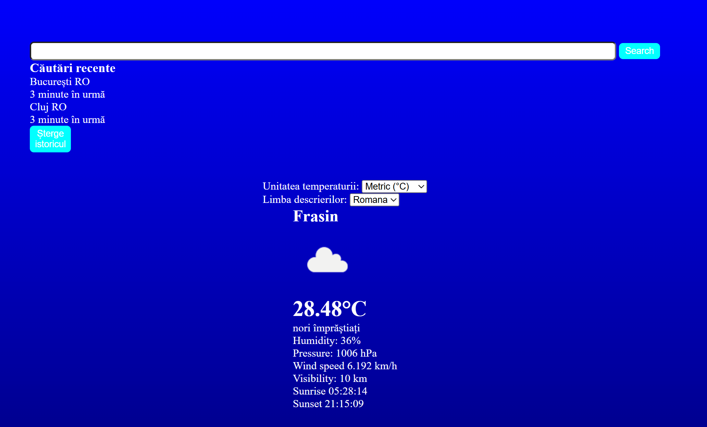

# 🌤️ Weather App - Modern JavaScript Weather Application

> O aplicație meteo completă construită cu vanilla JavaScript, integrând API-uri reale și best practices moderne.

[Demo Live](<https://codrinursachi.github.io/weather-app>) | [Cod Sursă](<https://github.com/codrinursachi/weather-app>)

## 🎯 Despre Proiect

- Magic app that can foresee the weather.

## ✨ Funcționalități

### Core Features

- 

### Advanced Features

- Includes search debouncing and weather data caching

### Technical Highlights

- Connects to openweather API and retrieves weather data

## 🛠️ Tehnologii Utilizate

### Frontend

- **Vanilla JavaScript (ES6+)** - Arhitectură modulară
- **CSS3** - Design responsive și modern
- **HTML5** - Structură semantică

### APIs & Services

- **OpenWeatherMap API** - Date meteo în timp real
- **Geolocation API** - Detectarea automată a locației
- **IP Geolocation API** - Fallback pentru locație

### Tools & Workflow

- **Git/GitHub** - Control versiuni și colaborare
- **VS Code** - Environment de dezvoltare
- **GitHub Pages** - Hosting gratuit

## 🚀 Demo și Screenshots



## 📦 Instalare și Rulare

### Cerințe

- Browser modern (Chrome, Firefox, Safari, Edge)
- API key gratuit de la OpenWeatherMap

### Setup Local

```bash
# Clone repository
git clone <https://github.com/codrinursachi/weather-app.git>
cd weather-app

# Configurare API key
# Editează modules/config.js și adaugă API key-ul tău
```
